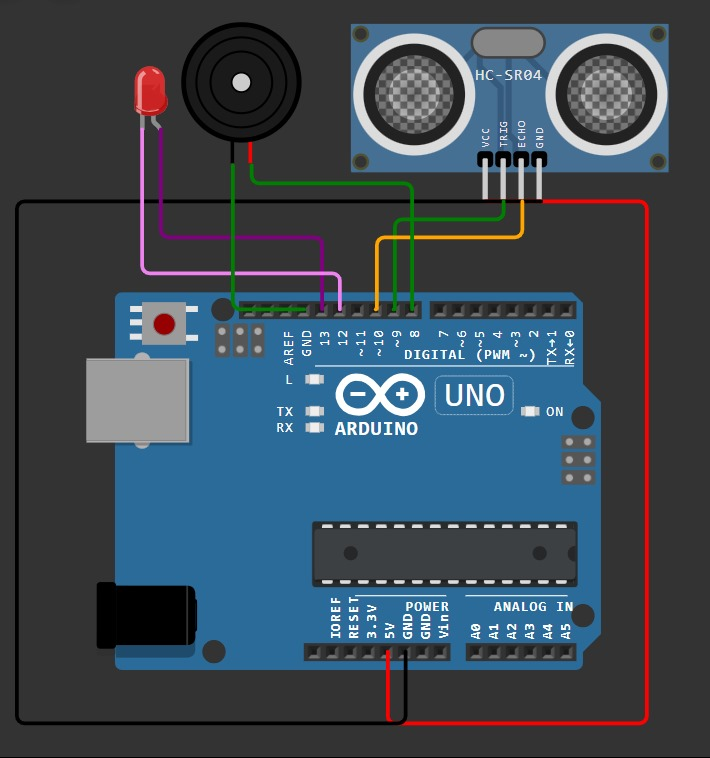
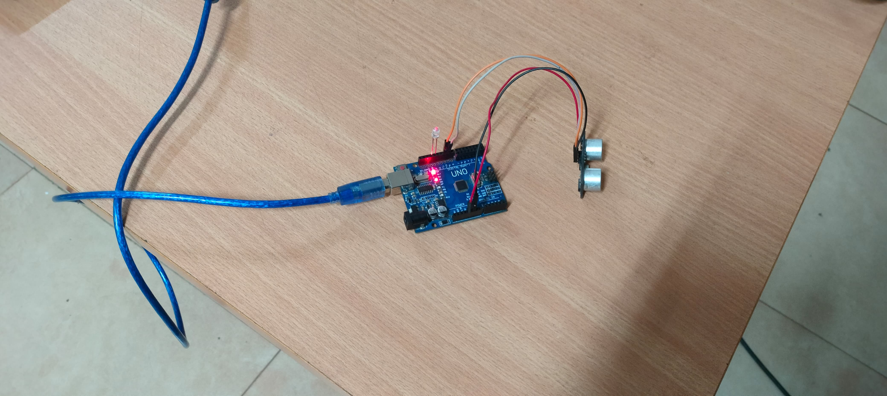
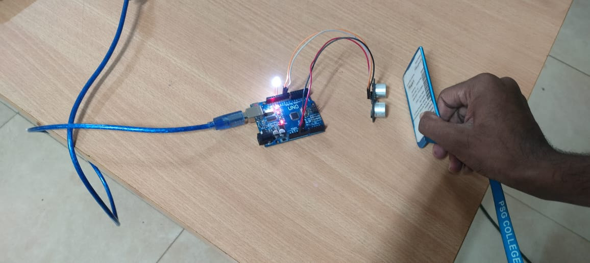

# Arduino Ultrasonic Object Detection System

## 📌 Project Overview

This project demonstrates an **Arduino UNO based ultrasonic object detection system** using an **HC-SR04 ultrasonic distance sensor**.

The system detects objects by measuring the distance between the ultrasonic sensor and the object. An LED and buzzer are used to provide visual and audible indications when an object is detected within a specified distance.

The project includes the complete wiring diagram, physical hardware setup, object detection demonstration, and working video.

---

## 🎯 Project Objective

The main objective of this project is to design and demonstrate a simple object detection system using an Arduino UNO and an HC-SR04 ultrasonic sensor.

The system can:

* Measure the distance of an object
* Detect whether an object is present
* Provide LED indication
* Provide buzzer indication
* Demonstrate real-time ultrasonic object detection

---

## 🛠️ Components Used

* Arduino UNO
* HC-SR04 Ultrasonic Sensor
* LED
* 220 Ω resistor
* Buzzer
* Jumper wires
* USB cable
* Computer/Laptop

---

## 🔌 Pin Connections

| Component | Pin          | Arduino UNO                |
| --------- | ------------ | -------------------------- |
| HC-SR04   | VCC          | 5V                         |
| HC-SR04   | TRIG         | D9                         |
| HC-SR04   | ECHO         | D10                        |
| HC-SR04   | GND          | GND                        |
| LED       | Anode (+)    | D13                        |
| LED       | Cathode (-)  | GND through 220 Ω resistor |
| Buzzer    | Positive (+) | D12                        |
| Buzzer    | Negative (-) | GND                        |

---

## ⚙️ Working Principle

The HC-SR04 ultrasonic sensor works by transmitting an ultrasonic pulse through the **TRIG** pin.

The ultrasonic wave travels toward an object and is reflected back to the sensor.

The **ECHO** pin measures the time taken for the ultrasonic wave to return.

The Arduino uses this time to calculate the distance.

### Distance Calculation

```text
Distance = (Time × Speed of Sound) / 2
```

The division by 2 is required because the ultrasonic signal travels from the sensor to the object and back to the sensor.

---

# 🔧 Wiring Diagram

The following diagram shows the electrical connections between the Arduino UNO, HC-SR04 ultrasonic sensor, LED, and other components.



---

# 🖥️ Hardware Setup

The complete physical hardware setup consists of an Arduino UNO connected to the HC-SR04 ultrasonic sensor and indicator components.


---

# 🟢 No Object Detected

The following image shows the system when there is no object within the configured detection range of the ultrasonic sensor.



---

# 🔴 Object Detected

The following image shows the system when an object is detected by the HC-SR04 ultrasonic sensor.

The LED/buzzer provides an indication according to the programmed detection condition.



---

# 🎥 Working Demonstration

The working video demonstrates the complete operation of the ultrasonic object detection system.

The video shows the sensor detecting an object and the corresponding indication from the system.

### Working Video

[▶️ Watch the Working Video](video/working-video.mp4)

---

# 🔄 System Operation

The system operates in the following sequence:

1. Arduino sends a trigger signal to the HC-SR04 sensor.
2. HC-SR04 transmits an ultrasonic pulse.
3. The ultrasonic pulse travels toward the object.
4. The pulse is reflected back from the object.
5. The ECHO pin receives the reflected signal.
6. Arduino measures the echo time.
7. The distance is calculated.
8. Arduino determines whether an object is within the detection range.
9. LED and buzzer provide the required indication.

---

# 📊 Detection Logic

The system can be programmed using a distance threshold.

For example:

| Object Condition                           | LED | Buzzer |
| ------------------------------------------ | --- | ------ |
| No object / object outside detection range | OFF | OFF    |
| Object detected within detection range     | ON  | ON     |

The detection distance can be modified in the Arduino program according to the application.

---

# 💻 Software

The project can be programmed using:

* Arduino IDE
* Arduino C/C++

---

# 📷 Project Demonstration

### Wiring Diagram


### Hardware Setup


### No Object Detected


### Object Detected


---

# 🚀 Applications

This project can be used as a basic system for:

* Obstacle detection
* Object detection
* Parking assistance
* Robot obstacle avoidance
* Distance measurement
* Automatic warning systems
* Arduino-based automation
* Industrial object detection

---

# 🔮 Future Improvements

The project can be further improved by adding:

* LCD or OLED display
* Servo motor for sensor scanning
* Multiple ultrasonic sensors
* Automatic obstacle avoidance
* IoT monitoring
* Wireless communication
* Mobile application monitoring
* Integration with industrial automation systems

---

# 📁 Project Structure

```text
Arduino-Ultrasonic-Object-Detection/
│
├── README.md
│
├── images/
│   ├── wiring-diagram.png
│   ├── hardware-setup.jpg
│   ├── no-object-detected.jpg
│   └── object-detected.jpg
│
└── video/
    └── working-video.mp4
```

---

# 👨‍💻 Author

**Sakthipriyan B**

---

# 📄 License

This project is created for educational and academic purposes.
